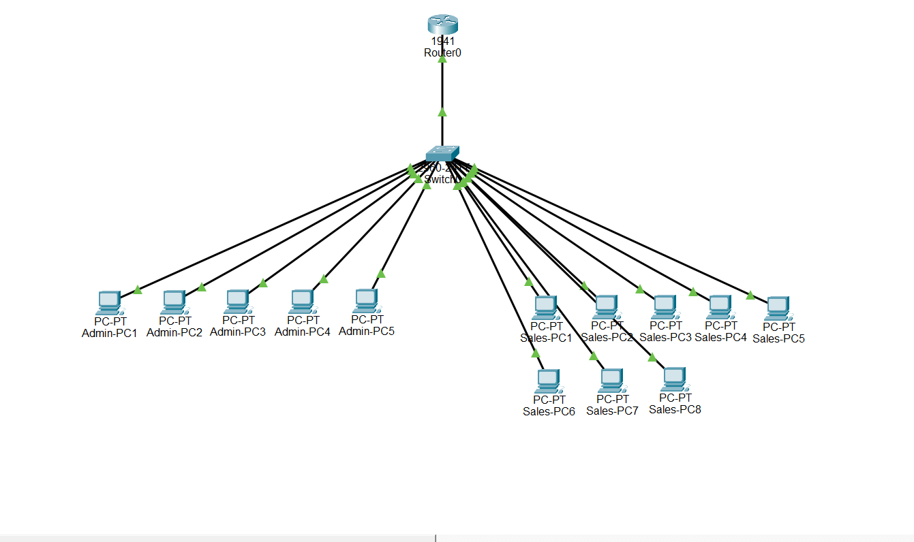

# Project 1: Small Business Network

## Project Overview

This project involves designing and configuring a basic network for a fictional small business called BrightTech Solutions.

The company has two departments:

- Administration: 5 computers
- Sales: 8 computers

The goal is to build a network that allows the computers to communicate while developing practical skills in network design, IP addressing, device configuration, connectivity testing, and troubleshooting.

## Learning Objectives

Through this project, I will practice:

- Identifying the roles of common networking devices
- Designing a basic network topology
- Configuring IPv4 addresses
- Understanding subnet masks and default gateways
- Configuring basic router and switch connectivity
- Testing connectivity using tools such as ping
- Troubleshooting common network connectivity problems
- Documenting network configurations and troubleshooting steps

## Tools

- Cisco Packet Tracer
- GitHub
- Windows Command Line

## Network Requirements

BrightTech Solutions currently has two departments:

| Department | Number of Computers |
|---|---:|
| Administration | 5 |
| Sales | 8 |

Further network requirements and configurations will be added as the project progresses.

## Network Topology

## Network Topology

The initial BrightTech Solutions network consists of one Cisco 1941 router,
one Cisco 2960 switch, five Administration PCs, and eight Sales PCs.

## IP Addressing

## IP Addressing

The network uses the private IPv4 network `192.168.10.0/24`.

- Subnet Mask: `255.255.255.0`
- Network Address: `192.168.10.0`
- Broadcast Address: `192.168.10.255`
- Usable Host Range: `192.168.10.1 - 192.168.10.254`
- Default Gateway: `192.168.10.1`

### IP Addressing Table

| Device | IP Address | Subnet Mask | Default Gateway |
|---|---|---|---|
| Router | 192.168.10.1 | 255.255.255.0 | N/A |
| Admin-PC1 | 192.168.10.10 | 255.255.255.0 | 192.168.10.1 |
| Admin-PC2 | 192.168.10.11 | 255.255.255.0 | 192.168.10.1 |
| Admin-PC3 | 192.168.10.12 | 255.255.255.0 | 192.168.10.1 |
| Admin-PC4 | 192.168.10.13 | 255.255.255.0 | 192.168.10.1 |
| Admin-PC5 | 192.168.10.14 | 255.255.255.0 | 192.168.10.1 |
| Sales-PC1 | 192.168.10.20 | 255.255.255.0 | 192.168.10.1 |
| Sales-PC2 | 192.168.10.21 | 255.255.255.0 | 192.168.10.1 |
| Sales-PC3 | 192.168.10.22 | 255.255.255.0 | 192.168.10.1 |
| Sales-PC4 | 192.168.10.23 | 255.255.255.0 | 192.168.10.1 |
| Sales-PC5 | 192.168.10.24 | 255.255.255.0 | 192.168.10.1 |
| Sales-PC6 | 192.168.10.25 | 255.255.255.0 | 192.168.10.1 |
| Sales-PC7 | 192.168.10.26 | 255.255.255.0 | 192.168.10.1 |
| Sales-PC8 | 192.168.10.27 | 255.255.255.0 | 192.168.10.1 |

## Configuration

Configuration steps will be documented as devices are configured.

## Testing and Troubleshooting

After configuring the router and assigning static IPv4 addresses to the PCs, connectivity was verified using ICMP ping tests.

The following tests were successfully completed:

- Admin-PC3 to the default gateway (`192.168.10.1`)
- Admin-PC5 to Sales-PC1 (`192.168.10.20`)
- Sales-PC8 to Admin-PC1 (`192.168.10.10`)

All tests returned four successful replies with 0% packet loss.

These tests confirmed that devices within the `192.168.10.0/24` network could communicate successfully through the switch and that the PCs could reach the router's LAN interface.

## What I Learned

During the initial network configuration, I learned how to:

- Design a basic LAN using a router, switch, and end devices.
- Connect different Ethernet devices using straight-through cables.
- Configure a router interface with an IPv4 address.
- Enable a Cisco router interface using the `no shutdown` command.
- Verify router interfaces using `show ip interface brief`.
- Assign static IPv4 addresses, subnet masks, and default gateways to end devices.
- Test connectivity using the `ping` command.
- Understand that devices on the same subnet communicate through the switch without requiring the router.
- Understand that a default gateway is used when a host needs to communicate with another network.
